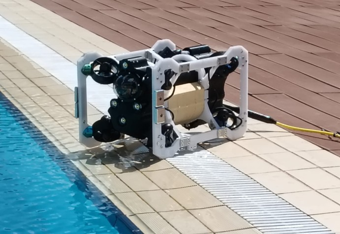

::: {.hero}
::: {}

IRC for Intelligent Manufacturing and Robotics · KFUPM

# Marine robots and sensing systems for coastal and engineered waters {.unnumbered}

We design, model, build and test underwater vehicles for inspection, environmental monitoring and scientific observation. Our work runs from mathematical models and simulation, through integrated prototypes, to validation in controlled water.

<a class="primary" href="research.html">Explore our research</a>
<a class="primary" href="applications.html">Partner with us</a>
<a class="secondary" href="join.html">Join the lab</a>

:::

<!-- Temporary still. Replace with the compressed hero loop once a clip is chosen and encoded (see docs/MEDIA.md):
<video autoplay muted loop playsinline poster="media/platforms/marjan-r1-pool-side.jpg" aria-label="Marjan-R1 during pool testing"><source src="media/hero.webm" type="video/webm"><source src="media/hero.mp4" type="video/mp4"></video> -->
::: {.media}
{fig-alt="Photo of Marjan-R1 at the edge of the test pool, tether attached."}
:::
:::

## Research grounded in real systems



## Problems we address

Underwater structures and water bodies are hard to observe, and periodic surveys leave gaps between observations. We work on:

<h3>Submerged infrastructure</h3>
Inspecting piers, berths, walls and intakes without sending divers into the water.

<h3>Ports, marinas and engineered waterways</h3>
Condition records over time instead of occasional snapshots.

<h3>Coastal and environmental monitoring</h3>
Water-quality sensing is a target application. It is not yet integrated on any of our platforms.

## Featured result

[FIGURE PLACEHOLDER: open-loop step responses, Marjan-R1 (own plot)]

### A dynamic model of a compact six-degree-of-freedom ROV {.unnumbered}

We derived a nonlinear model of Marjan-R1 and compared it with open-loop step responses from pool tests. The tests confirmed static buoyancy trim and showed strong coupling between axes, which is why we are developing closed-loop control. See the [publications](publications.qmd).

## Recent news



[All news](news.qmd)

## Working on a water-monitoring or inspection problem?

Talk to us about a pilot development and validation project. See [Applications & Partnerships](applications.qmd).
