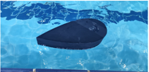
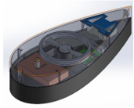

[TO CONFIRM status line]

Fish-like propulsion can be quiet and maneuverable. We study a robot fish driven by a reaction wheel, with locomotion control learned by reinforcement learning.

::: {.cards}
::: {.media}
{fig-alt="Photo of the reaction-wheel robot fish in the test pool."}
:::
::: {.media}
{fig-alt="Photo of the robot fish's internal reaction-wheel mechanism, opened up."}
:::
:::

[TO CONFIRM: status line and demonstrated-capabilities text, pending your confirmation of what the photos show.]

## Specification


