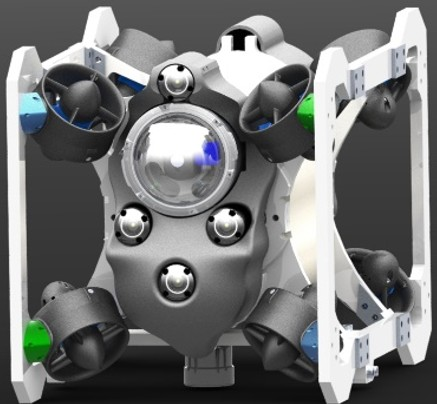
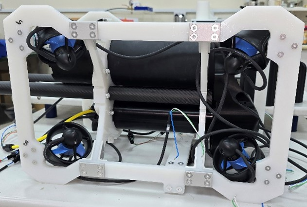
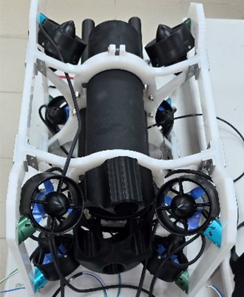

Integrated prototype. Validated in controlled pool experiments.

Marjan-R1 is an inspection-class remotely operated vehicle designed and built in-house: frame, pressure housings, electronics, firmware and control software. It is a research platform, so we can change any layer of it.

::: {.cards}
::: {.media}
{fig-alt="CAD render of Marjan-R1, an eight-thruster inspection ROV frame. This is a render, not a photo."}
:::
::: {.media}
{fig-alt="Photo of Marjan-R1 at the edge of the test pool, tether attached."}
:::
:::

::: {.cards}
::: {.media}
{fig-alt="Photo of Marjan-R1's frame and electronics in the lab."}
:::
::: {.media}
{fig-alt="Photo of Marjan-R1's frame and thrusters in the lab."}
:::
:::

## Design notes

- Neutrally buoyant open frame in HDPE with closed-cell foam floats. The center of gravity sits below the center of buoyancy, which gives passive stability.
- Eight thrusters at the frame corners, angled to give six-degree-of-freedom control. A thruster allocation matrix maps commanded forces and moments to thruster inputs.
- Modular electronics stack with over-the-air firmware updates.
- Sensors: inertial measurement unit, pressure sensor for depth, and ping sonar. The architecture allows a Doppler velocity log later.

## Specification



## Not yet demonstrated

Open-water or seawater operation, autonomy, and integrated water-quality sensing.
